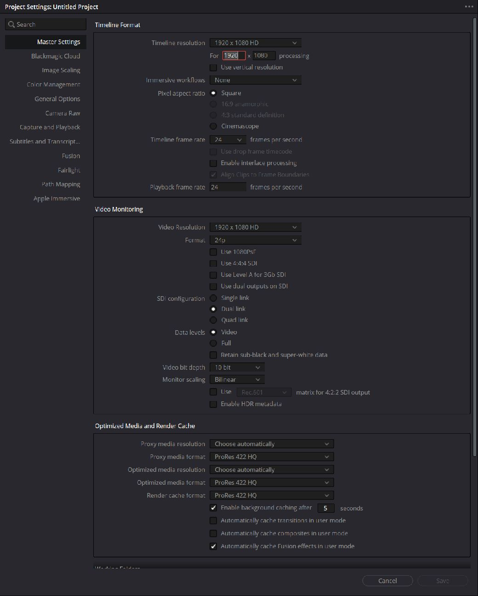
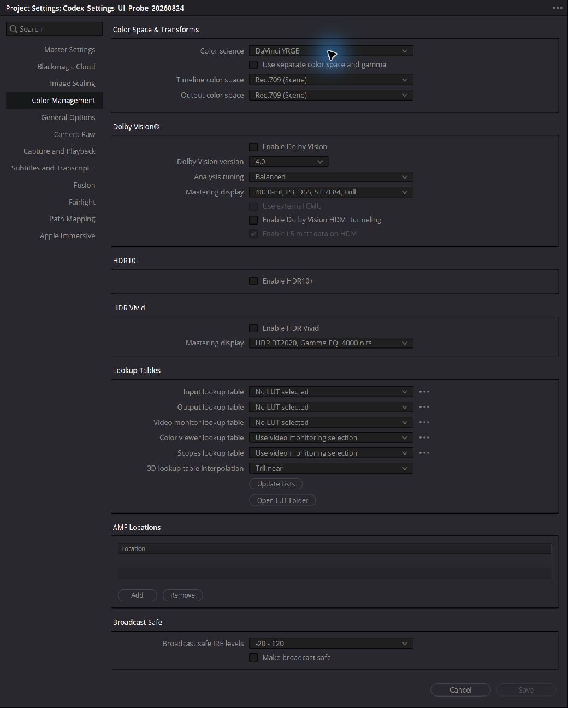
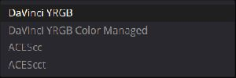
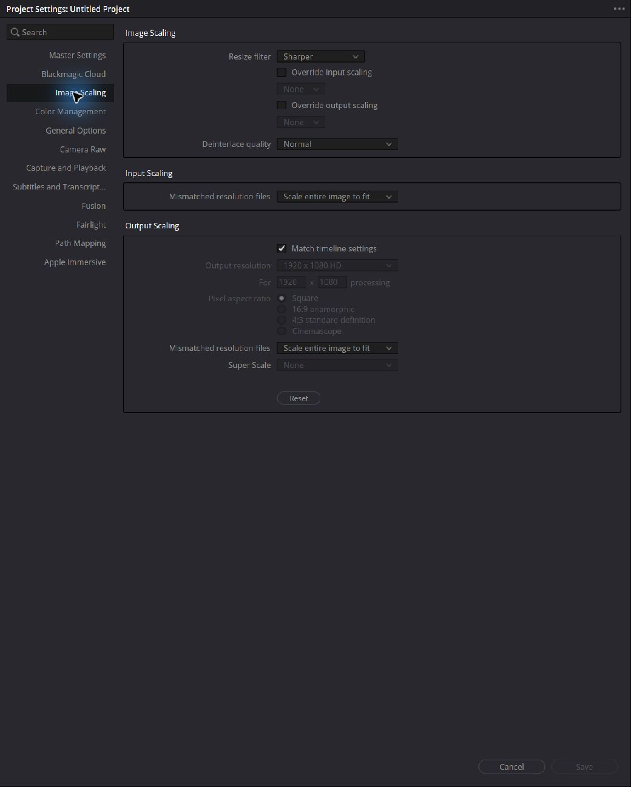

# Resolve GUIと本ライブラリ定数の対応

このページは、納品仕様や制作テンプレートに合わせてProject SettingsをPythonから自動設定したい人向けの対応表です。Resolveの画面で見える項目から、コードで指定する設定名と値を探せます。

## 名前の読み方

- **［Resolve GUI］** 「Project Settings」や「Timeline frame rate」は、Resolveの画面に表示される名前です。
- **［Resolve API］** `Project.SetSetting()`や設定キー`"timelineFrameRate"`は、Resolve公式Scripting APIの名前です。
- **［TY API］** `ProjectSetting`、`TimelineSetting`、`FrameRate`、`set_settings()`は、本ライブラリ`ty_davinci_resolve`からimportして使うPythonの名前です。Resolveの画面に表示される名称ではありません。

本文と表では、名前だけで所属を判断しにくい場合にこのタグを付けます。ダブルクォートは実際にPythonへ渡す文字列だけに使用します。

## 自動設定するときの基本方針

解像度、フレームレート、カラーマネージメントなど、作品全体の前提になる項目は、空のprojectを作成した直後に設定してください。素材のimportやtimelineの作成後は、作品の時間軸や既存clipへ影響するため、Resolveが変更を受け付けない項目があります。

フレームレートに関係するAPIキーは、Projectと個別timelineに2種類ずつ、次の4つがあります。ただし、4つすべてをPythonから変更できるわけではありません。

| ［Resolve GUI］対象 | ［Resolve GUI］画面項目 | 制作上の役割 | ［TY API］からの変更 |
|---|---|---|---|
| Project | Timeline frame rate | 新しく作るtimelineの基準となるフレームレート | ［TY API］`ProjectSetting.TIMELINE_FRAME_RATE`で設定可能。project作成直後に設定する |
| Project | Playback frame rate | Project Settingsで指定する再生フレームレート | 変更不可。［TY API］`ProjectSetting.TIMELINE_PLAYBACK_FRAME_RATE`で現在値の確認だけが可能 |
| 個別timeline | Timeline frame rate | そのtimelineを編集・再生するフレームレート | ［TY API］`TimelineSetting.TIMELINE_FRAME_RATE`で設定可能。空timelineに設定する |
| 個別timeline | Playback frame rate | 個別timelineには独立した設定項目がない | 設定不要。GUIにも選択項目がなく、［Resolve API］`Timeline.SetSetting()`からも変更できない |

作品を狙ったフレームレートで作るときは、まずProjectの「Timeline frame rate」を設定してください。特定のtimelineだけ別のフレームレートにする場合は、そのtimelineの「Timeline frame rate」を設定します。個別timelineはこの値で再生されるため、「Playback frame rate」を追加で設定する必要はありません。

一方、Projectの「Playback frame rate」を「Timeline frame rate」と異なる値にしたい場合、［Resolve API］`Project.SetSetting()`では変更できず、［TY API］からも自動化できません。必要な場合はProject SettingsのGUIで設定してください（Resolve Studio 21.0.4.5で確認）。

```python
from ty_davinci_resolve import (
    FrameRate,
    ProjectSetting,
    TimelineSetting,
    create_empty_timeline,
    get_media_pool,
    set_settings,
    set_timeline_settings,
)

# 新しく作るtimelineの既定値を24 fpsにする
set_settings(
    project,
    {ProjectSetting.TIMELINE_FRAME_RATE: FrameRate.FPS_24},
)

# この空timelineだけを25 fpsにする
timeline = create_empty_timeline(get_media_pool(project), "25 fps Timeline")
set_timeline_settings(
    timeline,
    {TimelineSetting.TIMELINE_FRAME_RATE: FrameRate.FPS_25},
)
```

［TY API］`set_timeline_settings()`は、最初に［Resolve API］設定キー`"useCustomSettings"`へ`"1"`を設定してから、指定されたtimeline設定を適用します。どちらの一括設定関数も、Resolveが設定を拒否した時点で例外を出して停止します。

## 対象環境と収録範囲

この文書はWindows版DaVinci Resolve Studio 21.0.4.5を対象とします。APIの基準資料は同梱の[Resolve 21.0.4 Scripting README](../official_documents/21.0.4_Scripting/README.txt)です（679–711行）。

［TY API］`ProjectSetting`クラスには、Pythonから設定できることを確認した151個の設定キーを定数として収録しています。調査対象は、［Resolve API］`Project.GetSetting()`から取得した158個の設定キーです。［TY API］`ProjectSetting`はResolveの画面名ではなく、設定キーの入力間違いを防ぐために本ライブラリが用意したPythonクラスです。

次の7個の設定キーは、［TY API］`ProjectSetting`には収録していません。自動設定には使用できないためです。［Resolve API］`Project.GetSetting()`で現在値を読み取ることはできますが、［Resolve API］`Project.SetSetting()`へ同じ値を書き戻してもResolveに拒否されます。

- `perfOptimisedCodec`
- `perfRenderCacheCodec`
- `superScaleNoiseReductionStrength`
- `superScaleSharpnessStrength`
- `videoCaptureCodec`
- `videoCaptureFormat`
- `videoDeckFormat`

## GUIと定数の対応

表中の「根拠」は次を表します。

- 公式: Resolve 21.0.4 Scripting READMEに値または設定方法が明記されている。
- GUI: Windows版Resolve Studio 21.0.4.5のProject Settingsで表示を確認した。
- 設定確認: 使い捨てprojectで値を設定し、Resolveから同じ値を読み取れることを確認した。

| ［Resolve GUI］Project Settingsの場所 | ［Resolve GUI］項目 | ［TY API］`ProjectSetting`定数 | ［TY API］値定数 | 根拠 |
|---|---|---|---|---|
| Master Settings > Timeline Format | Timeline resolution | `TIMELINE_RESOLUTION_WIDTH`, `TIMELINE_RESOLUTION_HEIGHT` | `ResolutionValue`（例: `"1920"`, `"1080"`） | GUI、設定確認 |
| Master Settings > Timeline Format | Timeline frame rate | `TIMELINE_FRAME_RATE` | `FrameRate`（例: `"24"`, `"29.97 DF"`） | 公式、GUI、設定確認 |
| Master Settings > Timeline Format | Playback frame rate | `ProjectSetting.TIMELINE_PLAYBACK_FRAME_RATE` | `PlaybackFrameRate`（現在値の確認用） | GUI、Project APIで変更不可 |
| Master Settings > Timeline Format | Pixel aspect ratio | `TIMELINE_PIXEL_ASPECT_RATIO` | `PixelAspectRatio`（例: `"square"`） | 公式、GUI |
| Master Settings > Video Monitoring | Video format | `VIDEO_MONITOR_FORMAT` | `make_video_monitor_format()`（例: `"HD 1080p 24"`） | GUI、設定確認 |
| Master Settings > Video Monitoring | SDI configuration | `VIDEO_MONITOR_SDI_CONFIGURATION` | `SDIConfiguration`（例: `"dual_link"`） | GUI、設定確認 |
| Master Settings > Video Monitoring | Bit depth | `VIDEO_MONITOR_BIT_DEPTH` | `VideoBitDepth`（`"8"`, `"10"`） | GUI、設定確認 |
| Master Settings > Video Monitoring | Data levels | `VIDEO_DATA_LEVELS` | `VideoDataLevel`（`"Video"`, `"Full"`） | GUI、設定確認 |
| Master Settings > Optimized Media and Render Cache | Optimized media resolution | `PERF_OPTIMIZED_RESOLUTION_RATIO` | `OptimizedMediaResolution` | GUI、設定確認 |
| Master Settings > Optimized Media and Render Cache | Proxy media resolution | `PERF_PROXY_RESOLUTION_RATIO` | `ProxyResolution` | GUI、設定確認 |
| Master Settings > Optimized Media and Render Cache | Proxy media usage | `PERF_PROXY_MEDIA_MODE` | `ProxyMediaMode` | GUI、設定確認 |
| Master Settings > Optimized Media and Render Cache | Render cache | `PERF_RENDER_CACHE_MODE` | `RenderCacheMode` | GUI、設定確認 |
| Master Settings > Frame Interpolation | Retime process | `IMAGE_RETIME_INTERPOLATION` | `RetimeInterpolation` | GUI、設定確認 |
| Master Settings > Frame Interpolation | Motion estimation mode | `IMAGE_MOTION_ESTIMATION_MODE` | `MotionEstimationMode` | GUI、設定確認 |
| Master Settings > Frame Interpolation | Motion range | `IMAGE_MOTION_ESTIMATION_RANGE` | `MotionEstimationRange` | GUI、設定確認 |
| Image Scaling | Resize filter | `IMAGE_RESIZE_MODE` | `ImageResizeMode` | GUI、設定確認 |
| Image Scaling | Super Scale | `SUPER_SCALE` | `SuperScale`（整数`0`–`4`） | 公式、GUI、設定確認 |
| Image Scaling | Super Scale sharpness / noise reduction | `SUPER_SCALE_SHARPNESS`, `SUPER_SCALE_NOISE_REDUCTION` | `SuperScaleDetail` | GUI、設定確認 |
| Color Management | Color science | `COLOR_SCIENCE_MODE` | `ColorScienceMode` | GUI、設定確認 |
| Color Management | Input / Timeline / Output color space | `COLOR_SPACE_INPUT`, `COLOR_SPACE_TIMELINE`, `COLOR_SPACE_OUTPUT` | `ColorSpace`, `OUTPUT_COLOR_SPACES` | GUI、設定確認 |
| Color Management | Input / Timeline / Output gamma | `COLOR_SPACE_INPUT_GAMMA`, `COLOR_SPACE_TIMELINE_GAMMA`, `COLOR_SPACE_OUTPUT_GAMMA` | `Gamma` | GUI、設定確認 |
| Color Management | Combined color space and gamma | `COLOR_SPACE_TIMELINE` | `ColorSpaceGamma` | GUI、設定確認 |
| Color Management | Timeline working luminance | `TIMELINE_WORKING_LUMINANCE_MODE`, `TIMELINE_WORKING_LUMINANCE` | `WorkingLuminanceMode`, 48–10,000 nit | GUI、設定確認 |
| Color Management | Input / Output DRT | `INPUT_DRT`, `OUTPUT_DRT` | `DynamicRangeTransform` | GUI、設定確認 |
| Color Management > ACES | ACES IDT / ODT | `COLOR_ACES_IDT`, `COLOR_ACES_ODT` | `AcesInputTransform`, `AcesOutputTransform` | GUI、設定確認 |
| Fairlight | Audio capture / playout channels | `AUDIO_CAPTURE_NUM_CHANNELS`, `AUDIO_PLAYOUT_NUM_CHANNELS` | `AudioChannelCount` | GUI、設定確認 |
| Fairlight | Loudness scale | `LIMIT_AUDIO_METER_LOUDNESS_SCALE` | `AudioMeterLoudnessScale` | GUI、設定確認 |
| Color | Broadcast safe levels | `LIMIT_BROADCAST_SAFE_LEVELS` | `BroadcastSafeLevel` | GUI、設定確認 |
| Color | Node stack layers | `NODE_STACK_LAYERS` | `NodeStackLayerCount` | GUI、設定確認 |

### Color scienceのGUI表示とAPI値

GUIラベルと`Project.SetSetting("colorScienceMode", value)`へ渡す文字列は一致しません。

| GUI表示 | `ColorScienceMode` | API value |
|---|---|---|
| DaVinci YRGB | `DAVINCI_YRGB` | `davinciYRGB` |
| DaVinci YRGB Color Managed | `DAVINCI_YRGB_COLOR_MANAGED` | `davinciYRGBColorManagedv2` |
| ACEScc | `ACES_CC` | `acescc` |
| ACEScct | `ACES_CCT` | `acescct` |

### 本ライブラリで指定できる定数値

本ライブラリの各定数クラスには、Resolve Studio 21.0.4.5で実際に設定でき、その後に同じ値を読み取れた値だけを収録しています。文字列を直接書くより、ここにある定数を使う方が綴りや大文字・小文字の間違いを防げます。

| 本ライブラリの定数クラス | Resolveへ渡すことを確認した値 |
|---|---|
| `AudioChannelCount` | `2`, `4`, `6`, `8`, `16` |
| `DeinterlaceQuality` | `normal`, `high` |
| `MotionEstimationMode` | `standardFaster`, `standardBetter`, `enhancedFaster`, `enhancedBetter` |
| `MotionEstimationRange` | `small`, `medium` |
| `ImageResizeMode` | `sharper`, `smoother`, `bicubic`, `bilinear` |
| `RetimeInterpolation` | `nearest`, `frameBlend`, `opticalFlow` |
| `AudioMeterLoudnessScale` | `ebu_9_scale`, `ebu_18_scale` |
| `BroadcastSafeLevel` | `0_100`, `10_110`, `20_120` |
| `NodeStackLayerCount` | `1`, `2`, `3`, `4` |
| `OptimizedMediaResolution` | `auto`, `original`, `half`, `quarter` |
| `ProxyMediaMode` | `0`, `1`, `2` |
| `ProxyResolution` | `original`, `half`, `quarter` |
| `RenderCacheMode` | `none`, `smart`, `user` |
| `SuperScaleDetail` | `Low`, `Medium`, `High` |
| `FrameRateMismatchBehavior` | `resolve`, `none` |
| `VideoBitDepth` | `8`, `10` |
| `SDIConfiguration` | `none`, `single_link`, `dual_link`, `quad_link`（項目により使用可能値が異なる） |

Resolve画面に選択肢が表示されても、Pythonから同じ値を設定できるとは限りません。自動化で使えなかった候補は定数へ追加していません。

## 開発者向け：設定値の再検証

Resolveの更新後に設定の互換性を調べ直す場合は、Pythonの`tests/integration/test_setting_constants.py`を使用します。このテストはProject Settingsのキーと候補値を実際に設定し、設定後の値を確認して、使い捨てprojectを削除します。ProjectとTimelineのフレームレート適用範囲は`test_timeline_frame_rate_settings.py`、詳細な調査出力が必要な場合は`probe_timeline_playback_frame_rate.py`で確認できます。

## スクリーンショット

次の画像は対象環境のWindows版Resolve Studio 21.0.4.5から取得しました。個別のdropdownを開いた画像は選択肢の観察だけを目的とし、値は変更していません。

### Master Settings

Timeline Format、Video Monitoring、Optimized Media and Render Cacheと、上表の主要な対応項目を確認できます。



### Color Management

新規projectの既定表示はColor scienceがDaVinci YRGB、Timeline／Output color spaceがRec.709 (Scene)でした。



Color science dropdownにはDaVinci YRGB、DaVinci YRGB Color Managed、ACEScc、ACEScctの4項目が表示されます。APIへ渡す値は上の対応表のとおりです。



### Image Scaling

ResolveのGUI項目Resize filterは、本ライブラリの`ProjectSetting.IMAGE_RESIZE_MODE`／`ImageResizeMode`に対応します。同様にDeinterlace qualityは`ProjectSetting.IMAGE_DEINTERLACE_QUALITY`／`DeinterlaceQuality`、Super Scaleは`ProjectSetting.SUPER_SCALE`／`SuperScale`に対応します。画面のSharper、Normal、Noneをコードで指定するときは、表示名をそのまま書かず、本ライブラリの対応する定数を使用してください。Resolve公式APIへ実際に渡る値は`sharper`、`normal`、`0`です。


